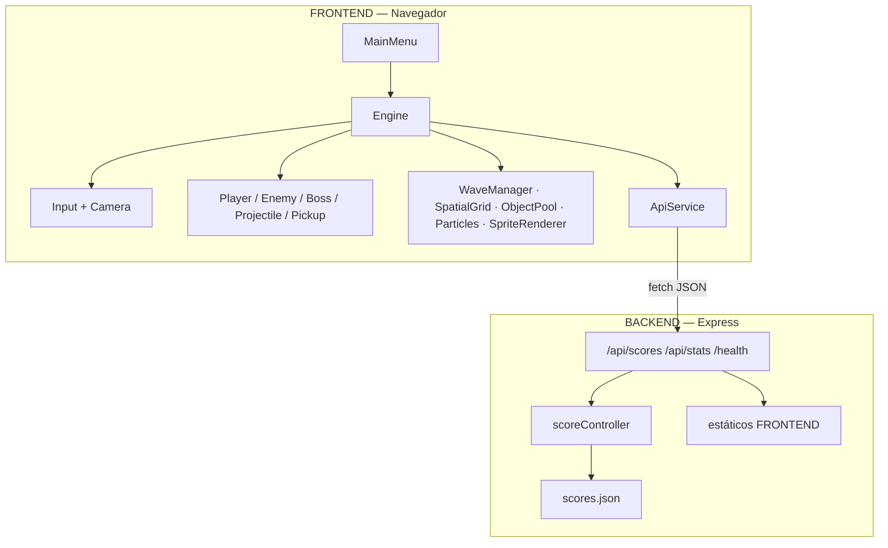

<div align="center">


[](#)
[](#)
[](#)
[](#)


**Proyecto académico — Desarrollo de Aplicaciones Web**

`Aram Dominguez Rivera` · `Saul Azola Huerta`

```
█▄░█ █▀▀ █▀█ █▄░█   █▀ █ █▀▀ █▀▀ █▀▀
█░▀█ ██▄ █▄█ █░▀█   ▄█ █ ██▄ █▄█ ██▄
```

</div>

---

<p align="center">
  <a href="#-transmision-nombre-y-proposito">Propósito</a> ·
  <a href="#-protocolo-de-combate-controles">Controles</a> ·
  <a href="#-instalacion-del-nucleo">Instalación</a> ·
  <a href="#-secuencia-de-arranque">Ejecución</a> ·
  <a href="#-arquitectura-del-sitio">Arquitectura</a> ·
  <a href="#-mapa-de-archivos">Estructura</a> ·
  <a href="#-algoritmos-en-el-nucleo">Algoritmos</a> ·
  <a href="#-api-rest--enlace-neural">API REST</a> ·
  <a href="#-recursos-externos">Recursos</a>
</p>

---

## 📡 TRANSMISIÓN: NOMBRE Y PROPÓSITO

> **Nombre:** **NEON SIEGE** — *Arena Survival*  
> **Clasificación:** shooter top-down de supervivencia en oleadas, corrido 100% en el navegador.

La ciudad se apagó. Quedó la arena. Tú eres el último piloto con un arsenal de neón y una orden simple: **aguantar**.

**NEON SIEGE** es un videojuego web donde el jugador sobrevive oleadas infinitas de enemigos (cazadores, enjambres, tanques, kamikazes, francotiradores) y jefes cíclicos (**Goliath Prime** / **Tempest Matrix**). Hay dash con energía, tres armas, combos, pickups, ranking global y un HUD de ciencia ficción.

No es un prototipo vacío: hay motor propio, física circular, grid espacial, object pooling, spritesheets animados, audio, menú, editor de mapa y persistencia de scores.

<table>
<tr>
<td width="50%">

**Lo que el piloto siente**
- Arena 2400×1800 con cover y pasillos
- Cámara que te sigue como un dron
- Oleadas que escalan HP, daño y velocidad
- Jefes cada ciclo, con fases 100 / 60 / 30
- Ranking TOP 10 sincronizado con el servidor

</td>
<td width="50%">

**Lo que el código demuestra**
- Canvas 2D + ES Modules
- API REST con Express
- Persistencia en `scores.json`
- FSM de IA por enemigo
- Debug overlay (F3) digno de un engine

</td>
</tr>
</table>

---

## 🎮 PROTOCOLO DE COMBATE (CONTROLES)

<div align="center">

| Input | Acción | Notas de combate |
|:-----:|:------:|:-----------------|
| <kbd>W</kbd> <kbd>A</kbd> <kbd>S</kbd> <kbd>D</kbd> | Mover | También sirven las flechas. Diagonales normalizadas (`1/√2`) |
| <kbd>MOUSE</kbd> | Apuntar | El cañón sigue al cursor en espacio de mundo |
| <kbd>CLICK IZQ</kbd> | Disparar | Cadencia, spread y munición según el arma |
| <kbd>ESPACIO</kbd> | Dash | Cuesta energía. I-frames mientras dura el dash |
| <kbd>1</kbd> | Pistola rápida | Munición infinita · cian |
| <kbd>2</kbd> | Escopeta de choque | 6 perdigones · rosa |
| <kbd>3</kbd> | Fusil de plasma | Penetración ×3 · verde |
| <kbd>P</kbd> / <kbd>ESC</kbd> | Pausa | Menú de pausa in-game |
| <kbd>F3</kbd> | Debug | Hitboxes, grid, vectores, FPS, labels FSM |

</div>

```
        ▲ W                 1  PISTOLA     ∞
      ◄ A   D ►             2  ESCOPETA    SG
        ▼ S                 3  PLASMA      PL
     [ ESPACIO ] DASH       🖱  AIM + FIRE
```

---

## 💾 INSTALACIÓN DEL NÚCLEO

### Requisitos

- **Node.js** 18+ (recomendado 20 LTS)
- **npm**
- Un navegador moderno (Chrome / Edge / Firefox)
- No hace falta PostgreSQL. El ranking vive en un JSON.

### Clonar y armar

```bash
git clone <url-del-repo>
cd "NEON SIEGE"

cd BACKEND
npm install
```

El frontend **no** tiene `package.json`: son módulos ES nativos servidos por Express.

> El cliente apunta a `http://localhost:4000/api` (`FRONTEND/SRC/config.js`).  
> Arranca el servidor en el **puerto 4000** para que ranking y save-score enganchen a la primera.

**Windows (PowerShell)**

```powershell
cd BACKEND
$env:PORT=4000
npm start
```

**macOS / Linux**

```bash
cd BACKEND
PORT=4000 npm start
```

O crea `BACKEND/.env`:

```env
PORT=4000
```

---

## 🚀 SECUENCIA DE ARRANQUE

```text
[1] npm start en BACKEND
[2] Express levanta API + estáticos
[3] Abre  →  http://localhost:4000
[4] AssetManager carga sprites + audio
[5] MainMenu → JUGAR → Engine._loop()
[6] Sobrevive. Muere. Graba el score. Repite.
```

| URL | Qué es |
|-----|--------|
| `http://localhost:4000` | Juego (menú + canvas) |
| `http://localhost:4000/api/scores` | Ranking TOP 10 |
| `http://localhost:4000/api/stats` | Stats globales |
| `http://localhost:4000/health` | Pulso del servidor |
| `http://localhost:4000/editor.html` | Editor de mapa (herramienta interna) |
| `http://localhost:4000/spritesheet.html` | Empaquetador de frames |

**Modo desarrollo del API**

```bash
cd BACKEND
npm run dev
```

(`nodemon` recarga al guardar.)

**Game loop (resumen)**

```
requestAnimationFrame
   ├─ dt = ahora - lastTime
   ├─ input + cámara
   ├─ player / enemigos / jefe
   ├─ pools de balas + partículas
   ├─ colisiones (grid + círculos)
   ├─ oleadas
   └─ draw mundo → HUD → debug
```

---

## 🏗 ARQUITECTURA DEL SITIO



**Capa cliente**
- `Engine` es el orquestador: tiempo, pausa, game over, HUD, audio, debug.
- Entidades heredan de `Entity` (posición, radio, clamp de arena, AABB vs círculo).
- Sistemas no son “entidades”: render, pooling, oleadas, assets, API.

**Capa servidor**
- Express + CORS + `express.json()`.
- Rutas fijas. El controlador valida y responde JSON.
- Persistencia: archivo `BACKEND/scores.json` (cola de escritura para no corromper el archivo).

**Decisión de diseño:** el pivote de sprites está en los **pies** (sombra y movimiento). El **hitbox de daño** se desplaza al centro visual para que disparar al torso/cabeza cuente.

---

## 🗂 MAPA DE ARCHIVOS

```text
NEON SIEGE/
├── README.md
├── docs/readme/neon-banner.svg
├── BACKEND/
│   ├── server.js                 # Express: API + estáticos
│   ├── package.json
│   ├── scores.json               # ranking persistente
│   ├── ROUTES/scoreRoutes.js     # POST/GET scores, GET stats
│   ├── CONTROLLERS/scoreController.js
│   └── CONFIG/db.js              # I/O JSON (ya no es PostgreSQL)
└── FRONTEND/
    ├── index.html                # canvas + menús
    ├── editor.html               # tool de mapa
    ├── spritesheet.html          # tool de sheets
    ├── CSS/style.css
    ├── ASSETS/                   # png, wav, mp3
    │   ├── CHARACTERS/ ENEMIES/ BOSSES/
    │   ├── SPRITES/ AUDIO/ TILES/ FX/ HUD/ DECALS/
    │   └── ASSETS_SPEC.md
    └── SRC/
        ├── main.js
        ├── config.js             # balance, arena, armas, assets
        ├── CORE/                 # Engine, Input, Camera, SpatialGrid
        ├── ENTITIES/             # Player, Enemy, Boss, Projectile, Pickup
        ├── SYSTEMS/              # Waves, Pool, Particles, API, Render
        ├── UI/MainMenu.js
        └── TOOLS/                # DebugOverlay, MapEditor
```

---

## 🧠 ALGORITMOS EN EL NÚCLEO

| Algoritmo | Dónde | Para qué |
|-----------|--------|----------|
| **Game loop con Δt** | `Engine._loop` | Movimiento independiente del FPS |
| **Normalización diagonal** | `Input.getMovementVector` | WASD en 8 dirs sin sprint accidental |
| **Lerp de cámara** | `Camera.follow` | Seguimiento suave + clamp a la arena |
| **Spatial Hash Grid** | `SpatialGrid` | Broad-phase: no testear N×M balas vs enemigos |
| **Círculo vs círculo** | `Engine` + entidades | Disparos, contacto, pickups |
| **Círculo vs AABB** | `Entity.resolveObstacleCollisions` | Cover / cajas de la arena |
| **Object Pool** | `ObjectPool` | Balas y partículas pre-alocadas (cero GC spikes) |
| **FSM de IA** | `Enemy` | `SPAWN → CHASE → ATTACK → RETREAT → DEAD` |
| **Separación tipo boid** | `Enemy` tipo `SWARM` | El enjambre no se apila en un pixel |
| **Spawn fuera de visión** | `WaveManager.spawnEnemy` | Distancia mínima 480 px al jugador |
| **Escalado exponencial** | `getMultipliers` | HP `1.08^w`, dmg `1.06^w`, spd `1.02^w` |
| **Oleada geométrica** | `startWave` | `12 × 1.35^(wave-1)` enemigos |
| **Combo con timeout** | `Engine` | Hasta ×5.0; se corta si dejas de matar |
| **Aim `atan2`** | `Player` | Ángulo cursor mundo − piloto |
| **Spritesheet + ancla** | `SpriteRenderer` | Frames enteros, `anchorY` pies, flipX |
| **Hitbox visual offset** | `Entity.getHitY` | El círculo de daño sube al sprite, no a los pies |
| **Throttle de SFX** | `Enemy` / `Boss` | Evita saturar el canal de audio |

**Colisión obstáculo (idea):** se toma el punto más cercano del rectángulo al centro del círculo; si la distancia es menor al radio, se empuja al actor por el overlap.

**Grid espacial (idea):** el mundo se parte en celdas de 120 px. Insertar / consultar solo vecindario. Las balas preguntan “quién está cerca” en O(k) en vez de O(n).

---

## 🔌 API REST — ENLACE NEURAL

Base: `http://localhost:4000/api`

Prefijo montado en `server.js` → `app.use('/api', scoreRoutes)`.

### `POST /api/scores`

Guarda una partida. El nombre se recorta a 30 caracteres.

**Body**

```json
{
  "player": "Piloto Neon",
  "score": 12800,
  "wave": 7,
  "timeSurvived": 214,
  "kills": 83,
  "bossesDefeated": 1
}
```

**201**

```json
{
  "message": "Partida guardada con éxito",
  "record": {
    "id": 1,
    "player_name": "Piloto Neon",
    "score": 12800,
    "wave_reached": 7,
    "time_survived_seconds": 214,
    "played_at": "2026-09-25T05:32:00.000Z"
  }
}
```

**400** si faltan `player` o `score` numérico.

### `GET /api/scores`

TOP 10 ordenado por `score` desc, desempate por tiempo sobrevivido.

Campos de cada fila: `id`, `player`, `score`, `wave`, `timeSurvived`, `kills`, `bossesDefeated`, `date`.

### `GET /api/stats`

```json
{
  "totalGamesPlayed": 12,
  "totalEnemiesKilled": 940,
  "totalBossesDefeated": 4,
  "highestScoreRecord": 22100
}
```

### `GET /health`

```json
{ "status": "OK", "timestamp": "..." }
```

El frontend habla con esto desde `FRONTEND/SRC/SYSTEMS/ApiService.js` (`fetch`). El menú pinta el ranking; el game over manda el score.

Persistencia física: **`BACKEND/scores.json`**.

---

## 🌐 RECURSOS EXTERNOS

| Recurso | Uso |
|---------|-----|
| **Node.js + npm** | Runtime del servidor |
| **Express 4** | HTTP, estáticos, JSON body |
| **cors** | El canvas y el API conviven en el mismo origin; CORS queda listo si se separan |
| **dotenv** | `PORT` y config local |
| **nodemon** | Recarga en desarrollo |
| **Canvas 2D API** | Todo el render del juego |
| **Web Audio / HTMLAudio** | BGM + SFX (unlock tras el primer input) |
| **ES Modules nativos** | Cero bundler en el cliente |
| **Mermaid / Shields.io / Typing SVG** | Este README (badges y banner vivo) |

**Assets internos (no CDN):** PNG-32 con alpha, spritesheets por fila de animación, tiles de arena, FX, HUD, WAV/MP3 en `FRONTEND/ASSETS/`. Contrato de recorte en `FRONTEND/ASSETS/ASSETS_SPEC.md`.

**Lo que ya no se usa:** PostgreSQL / `pg`. El ranking no pide un motor de base de datos.

---

## 🧪 HERRAMIENTAS DE CUBIERTA

| Tool | Cómo |
|------|------|
| Overlay de diagnóstico | <kbd>F3</kbd> in-game |
| Editor de mapa | `/editor.html` |
| Empaquetador de sprites | `/spritesheet.html` |

---

## 👥 CRÉDITOS — FIRMA EN EL NEÓN

<div align="center">

| Piloto | Rol |
|--------|-----|
| **Aram Dominguez Rivera** | Desarrollo |
| **Saul Azola Huerta** | Desarrollo |

**Materia:** Desarrollo de Aplicaciones Web  
**Proyecto:** NEON SIEGE — Arena Survival

<br/>

*Si la arena parpadea, no es un bug. Es el neón respirando.*

**END OF TRANSMISSION**

`◆ 00F0FF ◆ FF0077 ◆ 39FF14 ◆`

</div>
